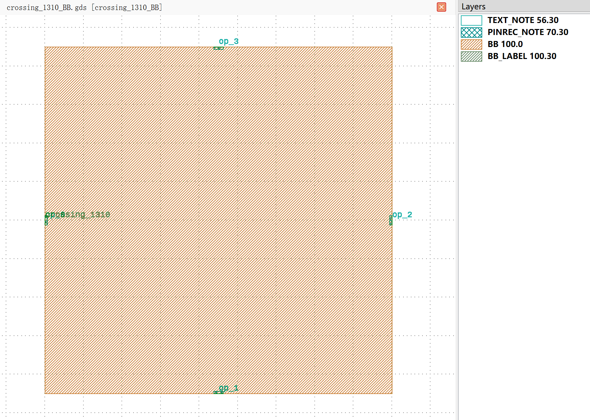
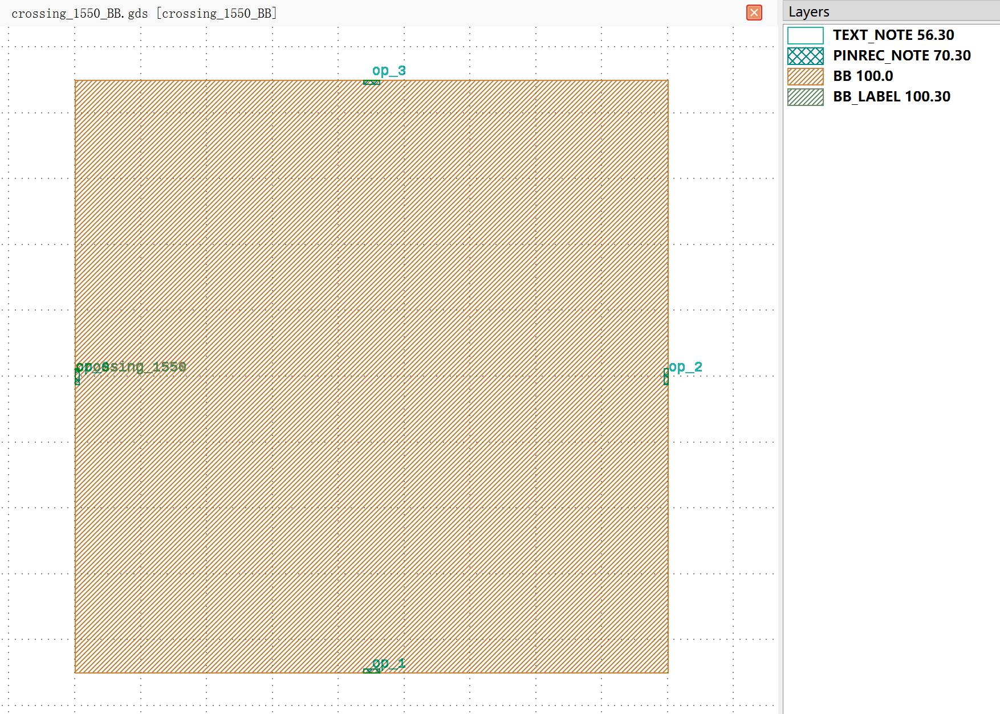

Crossing
#############################

crossing_1310_BB
**********************************************************

+-------------------+-----------------------------+------------------------+-------------+
|     ports         | waveguide type              | position               | degrees     |
+===================+=============================+========================+=============+
| op_0              | TECH.WG.RIB1.O.WIRE         | (0.0, 0.0)             | 180         |
+-------------------+-----------------------------+------------------------+-------------+
| op_1              | TECH.WG.RIB1.O.WIRE         | (22.5, -22.5)          | -90         |
+-------------------+-----------------------------+------------------------+-------------+
| op_2              | TECH.WG.RIB1.O.WIRE         | (45.0, 0.0)            | 0           |
+-------------------+-----------------------------+------------------------+-------------+
| op_3              | TECH.WG.RIB1.O.WIRE         | (22.5, 22.5)           | 90          |
+-------------------+-----------------------------+------------------------+-------------+

crossing_1550_BB
**********************************************************

+-------------------+-----------------------------+------------------------+-------------+
|     ports         | waveguide type              | position               | degrees     |
+===================+=============================+========================+=============+
| op_0              | TECH.WG.RIB1.C.WIRE         | (0.0, 0.0)             | 180         |
+-------------------+-----------------------------+------------------------+-------------+
| op_1              | TECH.WG.RIB1.C.WIRE         | (22.5, -22.5)          | -90         |
+-------------------+-----------------------------+------------------------+-------------+
| op_2              | TECH.WG.RIB1.C.WIRE         | (45.0, 0.0)            | 0           |
+-------------------+-----------------------------+------------------------+-------------+
| op_3              | TECH.WG.RIB1.C.WIRE         | (22.5, 22.5)           | 90          |
+-------------------+-----------------------------+------------------------+-------------+

