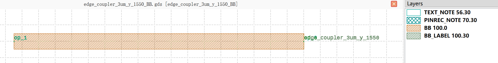
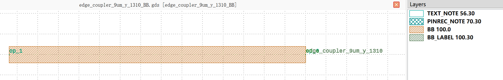
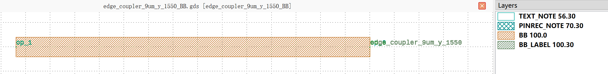

Edge Couplers (EC)
#############################

edge_coupler_3um_y_1310_BB
**********************************************************

+-------------------+-----------------------------+------------------------+-------------+
|     ports         | waveguide type              | position               | degrees     |
+===================+=============================+========================+=============+
| op_0              | TECH.WG.RIB1.O.WIRE         | (0.0, 0.0)             | 0           |
+-------------------+-----------------------------+------------------------+-------------+
| op_1              | TECH.WG.RIB1.O.WIRE         | (-350.0, 0.0)          | 180         |
+-------------------+-----------------------------+------------------------+-------------+

edge_coupler_3um_y_1550_BB
**********************************************************

+-------------------+-----------------------------+------------------------+-------------+
|     ports         | waveguide type              | position               | degrees     |
+===================+=============================+========================+=============+
| op_0              | TECH.WG.RIB1.C.WIRE         | (0.0, 0.0)             | 0           |
+-------------------+-----------------------------+------------------------+-------------+
| op_1              | TECH.WG.RIB1.C.WIRE         | (-350.0, 0.0)          | 180         |
+-------------------+-----------------------------+------------------------+-------------+

edge_coupler_9um_y_1310_BB
**********************************************************

+-------------------+-----------------------------+------------------------+-------------+
|     ports         | waveguide type              | position               | degrees     |
+===================+=============================+========================+=============+
| op_0              | TECH.WG.RIB1.O.WIRE         | (0.0, 0.0)             | 0           |
+-------------------+-----------------------------+------------------------+-------------+
| op_1              | TECH.WG.RIB1.O.WIRE         | (-720.0, 0.0)          | 180         |
+-------------------+-----------------------------+------------------------+-------------+

edge_coupler_9um_y_1550_BB
**********************************************************

+-------------------+-----------------------------+------------------------+-------------+
|     ports         | waveguide type              | position               | degrees     |
+===================+=============================+========================+=============+
| op_0              | TECH.WG.RIB1.C.WIRE         | (0.0, 0.0)             | 0           |
+-------------------+-----------------------------+------------------------+-------------+
| op_1              | TECH.WG.RIB1.C.WIRE         | (-720.0, 0.0)          | 180         |
+-------------------+-----------------------------+------------------------+-------------+

