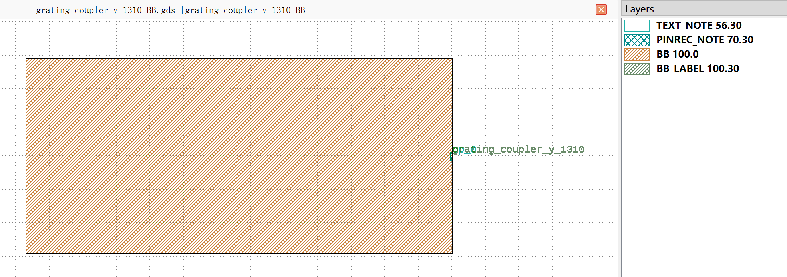
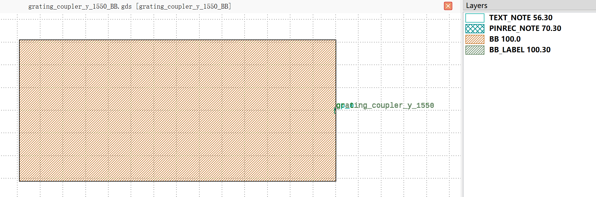
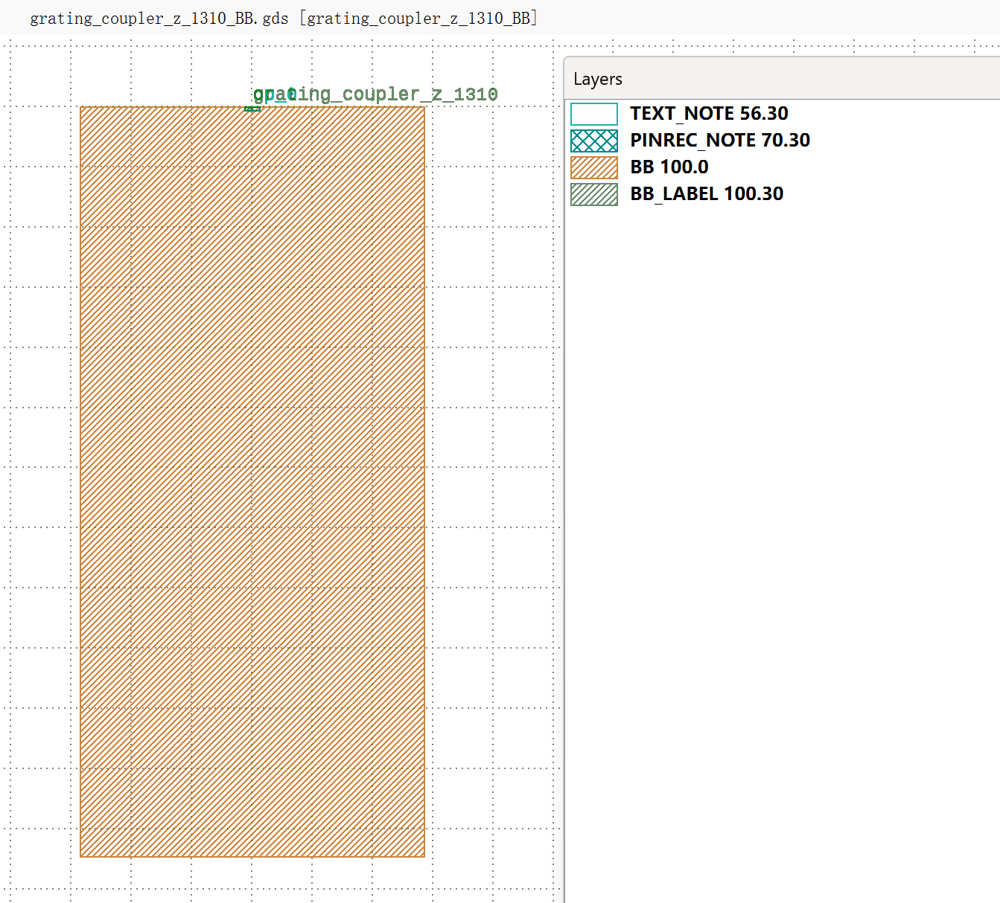
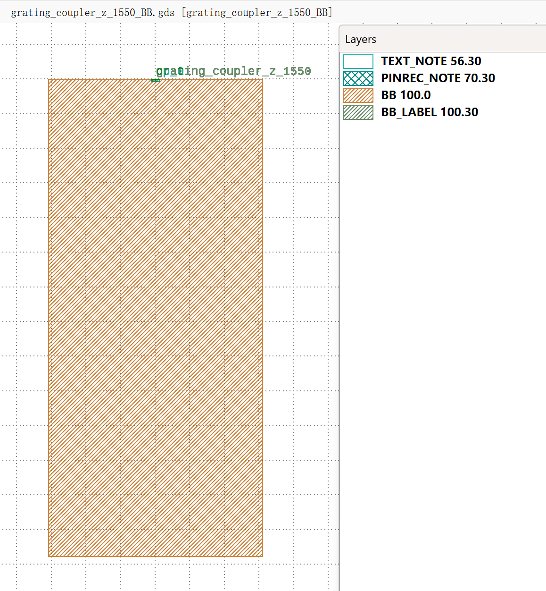

Grating Couplers (GC)
#############################

grating_coupler_y_1310_BB
*******************************************

+-------------------+-----------------------------+------------------------+-------------+
|     ports         | waveguide type              | position               | degrees     |
+===================+=============================+========================+=============+
| op_0              | TECH.WG.RIB1.O.WIRE         | (0.0, 0.0)             | 0           |
+-------------------+-----------------------------+------------------------+-------------+

grating_coupler_y_1550_BB
*******************************************

+-------------------+-----------------------------+------------------------+-------------+
|     ports         | waveguide type              | position               | degrees     |
+===================+=============================+========================+=============+
| op_0              | TECH.WG.RIB1.C.WIRE         | (0.0, 0.0)             | 0           |
+-------------------+-----------------------------+------------------------+-------------+

grating_coupler_z_1310_BB
*******************************************

+-------------------+-----------------------------+------------------------+-------------+
|     ports         | waveguide type              | position               | degrees     |
+===================+=============================+========================+=============+
| op_0              | TECH.WG.RIB1.O.WIRE         | (0.0, 0.0)             | 90          |
+-------------------+-----------------------------+------------------------+-------------+

grating_coupler_z_1550_BB
*******************************************

+-------------------+-----------------------------+------------------------+-------------+
|     ports         | waveguide type              | position               | degrees     |
+===================+=============================+========================+=============+
| op_0              | TECH.WG.RIB1.C.WIRE         | (0.0, 0.0)             | 90          |
+-------------------+-----------------------------+------------------------+-------------+

