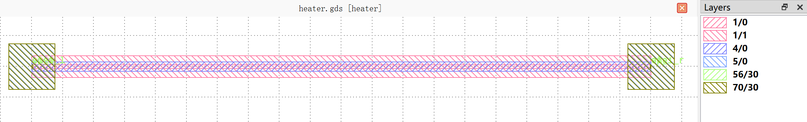

Heater
############################

heater
******************************************************

+----------------+----------------------+------------------------------------------------------------------------------------------------------+
| Parameters     |     Range            | Description                                                                                          |
+================+======================+======================================================================================================+
|wg_width        | Positive value       | Waveguide width.                                                                                     |
+----------------+----------------------+------------------------------------------------------------------------------------------------------+
|heater_with_pad | True or False        | Heater with pad or not. Set it to False to do the routing yourself.                                  |
+----------------+----------------------+------------------------------------------------------------------------------------------------------+
|heater_width    | Positive value       | Heater width.                                                                                        |
+----------------+----------------------+------------------------------------------------------------------------------------------------------+
|heater_length   | Positive value       | Heater length.                                                                                       |
+----------------+----------------------+------------------------------------------------------------------------------------------------------+

+----------------------+------------------------+-------------+
|      ports           |     waveguide type     |   degrees   |
+======================+========================+=============+
|op_0                  |  TECH.WG.LN.C.WIRE     |     180     |
+----------------------+------------------------+-------------+
|op_1                  |  TECH.WG.LN.C.WIRE     |     0       |
+----------------------+------------------------+-------------+

+----------------------+------------------------+-------------+
|     pins             | metal line type        |  degrees    |
+======================+========================+=============+
|ele1_0                |  TECH.METAL.M1.W15     |     180     |
+----------------------+------------------------+-------------+
|ele1_1                |  TECH.METAL.M1.W15     |     -90     |
+----------------------+------------------------+-------------+
|ele1_2                |  TECH.METAL.M1.W15     |     90      |
+----------------------+------------------------+-------------+
|ele1_3                |  TECH.METAL.M1.W15     |     0       |
+----------------------+------------------------+-------------+
|ele1_4                |  TECH.METAL.M1.W15     |     -90     |
+----------------------+------------------------+-------------+
|ele1_5                |  TECH.METAL.M1.W15     |     90      |
+----------------------+------------------------+-------------+
