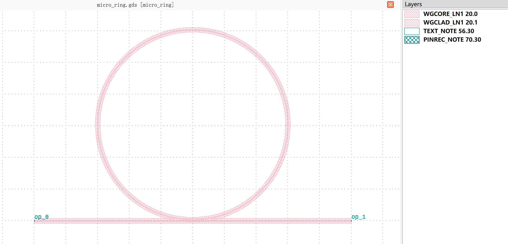

micro_ring
#############################################

micro_ring
******************************************************

+------------------+----------------------+-------------+------------------------------------------------------------------------------------------------------+
| Parameters       |     Range            | Default     | Description                                                                                          |
+==================+======================+=============+======================================================================================================+
|gap               | PositiveFloat value  | 0.7         | Sbend length.                                                                                        |
+------------------+----------------------+-------------+------------------------------------------------------------------------------------------------------+
|R                 | PositiveFloat value  | 150         | Radius of microring.                                                                                 |
+------------------+----------------------+-------------+------------------------------------------------------------------------------------------------------+
|core_width        | PositiveFloat value  | 1.2         | Minimum points of sbend.                                                                             |
+------------------+----------------------+-------------+------------------------------------------------------------------------------------------------------+
|trench_width      | PositiveFloat value  | 3           | Minimum radius of sbend.                                                                             |
+------------------+----------------------+-------------+------------------------------------------------------------------------------------------------------+
|wg_length         | PositiveFloat value  | 500         | Waveguide length.                                                                                    |
+------------------+----------------------+-------------+------------------------------------------------------------------------------------------------------+
|crossing          | Boolean value        | False       | Microring with drop or not                                                                           |
+------------------+----------------------+-------------+------------------------------------------------------------------------------------------------------+

if all the parameters are set to default values, the device will have 2 ports for waveguide connection. The port and pin information is listed below.  

+----------------------+------------------------+------------------------+-------------+
|      ports           |     waveguide type     | position               |   degrees   |
+======================+========================+========================+=============+
|op_0                  |  TECH.WG.RIB1.C.WIRE   |  (-100.0, 0.0)         |     180     |
+----------------------+------------------------+------------------------+-------------+
|op_1                  |  TECH.WG.RIB1.C.WIRE   |  (400.0, 0.0)          |     0       |
+----------------------+------------------------+------------------------+-------------+

                                                                                   