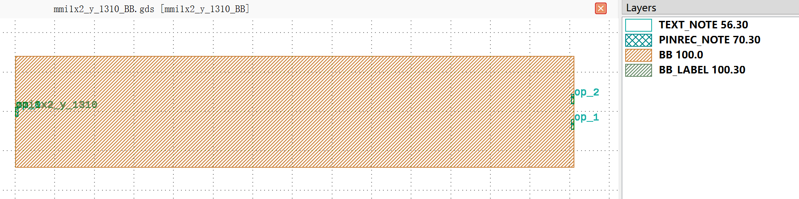
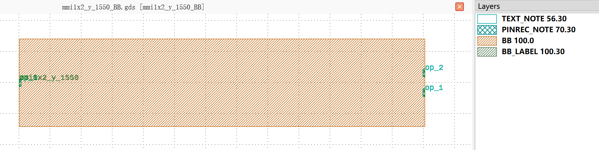
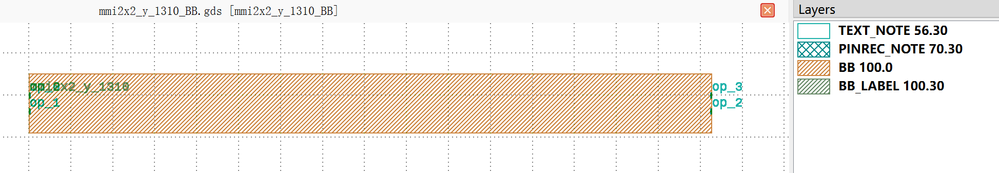
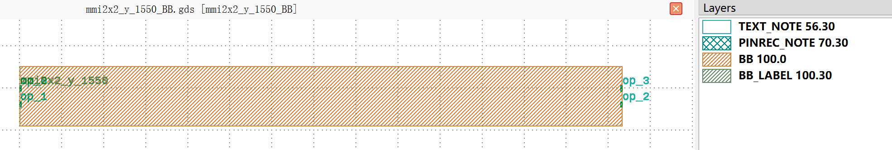

MultiMode Interferometers (MMI)
############################################

mmi1x2_y_1310_BB
**********************************************************

+-------------------+-----------------------------+------------------------+-------------+
|     ports         | waveguide type              | position               | degrees     |
+===================+=============================+========================+=============+
| op_0              | TECH.WG.RIB1.O.WIRE         | (0.0, 0.0)             | 180         |
+-------------------+-----------------------------+------------------------+-------------+
| op_1              | TECH.WG.RIB1.O.WIRE         | (70.5, -1.6)           | 0           |
+-------------------+-----------------------------+------------------------+-------------+
| op_2              | TECH.WG.RIB1.O.WIRE         | (70.5, 1.6)            | 0           |
+-------------------+-----------------------------+------------------------+-------------+

mmi1x2_y_1550_BB
**********************************************************

+-------------------+-----------------------------+------------------------+-------------+
|     ports         | waveguide type              | position               | degrees     |
+===================+=============================+========================+=============+
| op_0              | TECH.WG.RIB1.C.WIRE         | (0.0, 0.0)             | 180         |
+-------------------+-----------------------------+------------------------+-------------+
| op_1              | TECH.WG.RIB1.C.WIRE         | (65.2, -1.6)           | 0           |
+-------------------+-----------------------------+------------------------+-------------+
| op_2              | TECH.WG.RIB1.C.WIRE         | (65.2, 1.6)            | 0           |
+-------------------+-----------------------------+------------------------+-------------+

mmi2x2_y_1310_BB
**********************************************************

+-------------------+-----------------------------+------------------------+-------------+
|     ports         | waveguide type              | position               | degrees     |
+===================+=============================+========================+=============+
| op_0              | TECH.WG.RIB1.O.WIRE         | (0.0, 0.0)             | 180         |
+-------------------+-----------------------------+------------------------+-------------+
| op_1              | TECH.WG.RIB1.O.WIRE         | (0.0, -3.8)            | 180         |
+-------------------+-----------------------------+------------------------+-------------+
| op_2              | TECH.WG.RIB1.O.WIRE         | (162.6, -3.8)          | 0           |
+-------------------+-----------------------------+------------------------+-------------+
| op_3              | TECH.WG.RIB1.O.WIRE         | (162.6, 0.0)           | 0           |
+-------------------+-----------------------------+------------------------+-------------+

mmi2x2_y_1550_BB
**********************************************************

+-------------------+-----------------------------+------------------------+-------------+
|     ports         | waveguide type              | position               | degrees     |
+===================+=============================+========================+=============+
| op_0              | TECH.WG.RIB1.C.WIRE         | (0.0, 0.0)             | 180         |
+-------------------+-----------------------------+------------------------+-------------+
| op_1              | TECH.WG.RIB1.C.WIRE         | (0.0, -3.8)            | 180         |
+-------------------+-----------------------------+------------------------+-------------+
| op_2              | TECH.WG.RIB1.C.WIRE         | (143.2, -3.8)          | 0           |
+-------------------+-----------------------------+------------------------+-------------+
| op_3              | TECH.WG.RIB1.C.WIRE         | (143.2, 0.0)           | 0           |
+-------------------+-----------------------------+------------------------+-------------+

