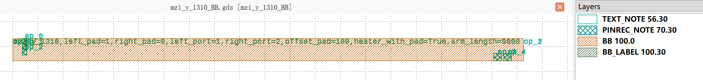
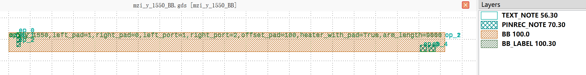

Mach-Zehnder interferometers (MZI)
#############################################

mzi_y_1310_BB
******************************************************

+------------------+----------------------+-------------+------------------------------------------------------------------------------------------------------+
| Parameters       |     Range            | Default     | Description                                                                                          |
+==================+======================+=============+======================================================================================================+
|left_pad          | Int value            | 1           | Pad Type, 0:Termination 1:Straight 2:Bent 3:BentMirror.                                              |
+------------------+----------------------+-------------+------------------------------------------------------------------------------------------------------+
|right_pad         | Int value            | 0           | Pad Type, 0:Termination 1:Straight 2:Bent 3:BentMirror.                                              |
+------------------+----------------------+-------------+------------------------------------------------------------------------------------------------------+
|left_port         | PositiveInt value    | 1           | Left port for input numbers.                                                                         |
+------------------+----------------------+-------------+------------------------------------------------------------------------------------------------------+
|right_port        | PositiveInt value    | 2           | Right port for input numbers.                                                                        |
+------------------+----------------------+-------------+------------------------------------------------------------------------------------------------------+
|offset_pad        | Float value          | 100         | Pad offset.                                                                                          |
+------------------+----------------------+-------------+------------------------------------------------------------------------------------------------------+
|heater_with_pad   | Boolean value        | True        | Heater with pad or not. Set it to False to do the routing yourself.                                  |
+------------------+----------------------+-------------+------------------------------------------------------------------------------------------------------+
|arm_length        | PositiveFloat value  | 9000        | Arm length.                                                                                          |
+------------------+----------------------+-------------+------------------------------------------------------------------------------------------------------+

if all the parameters are set to default values, the device will have 3 ports for waveguide connection and 5 pins for electrical connection. The port and pin information is listed below.  

+----------------------+------------------------+------------------------+-------------+
|      ports           |     waveguide type     | position               |   degrees   |
+======================+========================+========================+=============+
|op_0                  |  TECH.WG.RIB1.O.WIRE   |  (0.0, 0.0)            |     180     |
+----------------------+------------------------+------------------------+-------------+
|op_1                  |  TECH.WG.RIB1.O.WIRE   |  (10125.1, 1.9)        |     0       |
+----------------------+------------------------+------------------------+-------------+
|op_2                  |  TECH.WG.RIB1.O.WIRE   |  (10125.1, -1.9)       |     0       |
+----------------------+------------------------+------------------------+-------------+

+----------------------+------------------------+------------------------+-------------+
|     pins             | metal line type        | position               |  degrees    |
+======================+========================+========================+=============+
|ele1_0                |  TECH.METAL.M1.W15     |  (231.5, 110.0)        |     180     |
+----------------------+------------------------+------------------------+-------------+
|ele1_1                |  TECH.METAL.M1.W15     |  (231.5, 0.0)          |     180     |
+----------------------+------------------------+------------------------+-------------+
|ele1_2                |  TECH.METAL.M1.W15     |  (231.5, -110.0)       |     180     |
+----------------------+------------------------+------------------------+-------------+
|ele1_3                |  TECH.METAL.M1.W15     |  (9606.5, -206.0)      |     -90     |
+----------------------+------------------------+------------------------+-------------+
|ele1_4                |  TECH.METAL.M1.W15     |  (9806.5, -206.0)      |     -90     |
+----------------------+------------------------+------------------------+-------------+

mzi_y_1550_BB
******************************************************

+------------------+----------------------+-------------+------------------------------------------------------------------------------------------------------+
| Parameters       |     Range            | Default     | Description                                                                                          |
+==================+======================+=============+======================================================================================================+
|left_pad          | Int value            | 1           | Pad Type, 0:Termination 1:Straight 2:Bent 3:BentMirror.                                              |
+------------------+----------------------+-------------+------------------------------------------------------------------------------------------------------+
|right_pad         | Int value            | 0           | Pad Type, 0:Termination 1:Straight 2:Bent 3:BentMirror.                                              |
+------------------+----------------------+-------------+------------------------------------------------------------------------------------------------------+
|left_port         | PositiveInt value    | 1           | Left port for input numbers.                                                                         |
+------------------+----------------------+-------------+------------------------------------------------------------------------------------------------------+
|right_port        | PositiveInt value    | 2           | Right port for input numbers.                                                                        |
+------------------+----------------------+-------------+------------------------------------------------------------------------------------------------------+
|offset_pad        | Float value          | 100         | Pad offset.                                                                                          |
+------------------+----------------------+-------------+------------------------------------------------------------------------------------------------------+
|heater_with_pad   | Boolean value        | True        | Heater with pad or not. Set it to False to do the routing yourself.                                  |
+------------------+----------------------+-------------+------------------------------------------------------------------------------------------------------+
|arm_length        | PositiveFloat value  | 9000        | Arm length.                                                                                          |
+------------------+----------------------+-------------+------------------------------------------------------------------------------------------------------+

if all the parameters are set to default values, the device will have 3 ports for waveguide connection and 5 pins for electrical connection. The port and pin information is listed below.  

+----------------------+------------------------+------------------------+-------------+
|      ports           |     waveguide type     | position               |   degrees   |
+======================+========================+========================+=============+
|op_0                  |  TECH.WG.RIB1.C.WIRE   |  (0.0, 0.0)            |     180     |
+----------------------+------------------------+------------------------+-------------+
|op_1                  |  TECH.WG.RIB1.C.WIRE   |  (10098.4, 1.9)        |     0       |
+----------------------+------------------------+------------------------+-------------+
|op_2                  |  TECH.WG.RIB1.C.WIRE   |  (10098.4, -1.9)       |     0       |
+----------------------+------------------------+------------------------+-------------+

+----------------------+------------------------+------------------------+-------------+
|     pins             | metal line type        | position               |  degrees    |
+======================+========================+========================+=============+
|ele1_0                |  TECH.METAL.M1.W15     |  (225.2, 110.0)        |     180     |
+----------------------+------------------------+------------------------+-------------+
|ele1_1                |  TECH.METAL.M1.W15     |  (225.2, 0.0)          |     180     |
+----------------------+------------------------+------------------------+-------------+
|ele1_2                |  TECH.METAL.M1.W15     |  (225.2, -110.0)       |     180     |
+----------------------+------------------------+------------------------+-------------+
|ele1_3                |  TECH.METAL.M1.W15     |  (9600.2, -205.5)      |     -90     |
+----------------------+------------------------+------------------------+-------------+
|ele1_4                |  TECH.METAL.M1.W15     |  (9800.5, -205.5)      |     -90     |
+----------------------+------------------------+------------------------+-------------+