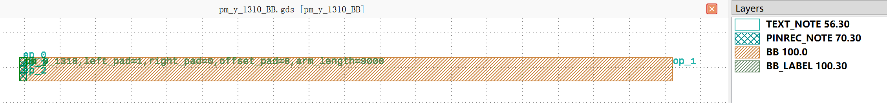
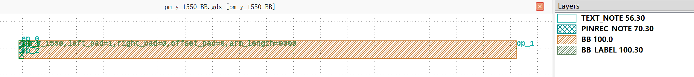

PM
############################

pm_y_1310_BB
******************************************************

+------------------+----------------------+-------------+------------------------------------------------------------------------------------------------------+
| Parameters       |     Range            | Default     | Description                                                                                          |
+==================+======================+=============+======================================================================================================+
|left_pad          | Int value            | 1           | Pad Type, 0:Termination 1:Straight 2:Bent 3:BentMirror.                                              |
+------------------+----------------------+-------------+------------------------------------------------------------------------------------------------------+
|right_pad         | Int value            | 0           | Pad Type, 0:Termination 1:Straight 2:Bent 3:BentMirror.                                              |
+------------------+----------------------+-------------+------------------------------------------------------------------------------------------------------+
|offset_pad        | Float value          | 0           | Pad offset.                                                                                          |
+------------------+----------------------+-------------+------------------------------------------------------------------------------------------------------+
|arm_length        | PositiveFloat value  | 9000        | Arm length.                                                                                          |
+------------------+----------------------+-------------+------------------------------------------------------------------------------------------------------+

if all the parameters are set to default values, the device will have 3 ports for waveguide connection and 5 pins for electrical connection. The port and pin information is listed below.  

+----------------------+------------------------+------------------------+-------------+
|      ports           |     waveguide type     | position               |   degrees   |
+======================+========================+========================+=============+
|op_0                  |  TECH.WG.RIB1.O.WIRE   |  (0.0, 0.0)            |     180     |
+----------------------+------------------------+------------------------+-------------+
|op_1                  |  TECH.WG.RIB1.O.WIRE   |  (9100.0, 0.0)         |      0      |
+----------------------+------------------------+------------------------+-------------+

+----------------------+------------------------+------------------------+-------------+
|     pins             | metal line type        | position               |  degrees    |
+======================+========================+========================+=============+
|ele1_0                |  TECH.METAL.M1.W15     |  (-25.0, 89.0)         |     180     |
+----------------------+------------------------+------------------------+-------------+
|ele1_1                |  TECH.METAL.M1.W15     |  (-25.0, -21.0)        |     180     |
+----------------------+------------------------+------------------------+-------------+
|ele1_2                |  TECH.METAL.M1.W15     |  (-25.0, -131.0)       |     180     |
+----------------------+------------------------+------------------------+-------------+

pm_y_1550_BB
******************************************************

+------------------+----------------------+-------------+------------------------------------------------------------------------------------------------------+
| Parameters       |     Range            | Default     | Description                                                                                          |
+==================+======================+=============+======================================================================================================+
|left_pad          | Int value            | 1           | Pad Type, 0:Termination 1:Straight 2:Bent 3:BentMirror.                                              |
+------------------+----------------------+-------------+------------------------------------------------------------------------------------------------------+
|right_pad         | Int value            | 0           | Pad Type, 0:Termination 1:Straight 2:Bent 3:BentMirror.                                              |
+------------------+----------------------+-------------+------------------------------------------------------------------------------------------------------+
|offset_pad        | Float value          | 0           | Pad offset.                                                                                          |
+------------------+----------------------+-------------+------------------------------------------------------------------------------------------------------+
|arm_length        | PositiveFloat value  | 9000        | Arm length.                                                                                          |
+------------------+----------------------+-------------+------------------------------------------------------------------------------------------------------+

if all the parameters are set to default values, the device will have 3 ports for waveguide connection and 5 pins for electrical connection. The port and pin information is listed below.  

+----------------------+------------------------+------------------------+-------------+
|      ports           |     waveguide type     | position               |   degrees   |
+======================+========================+========================+=============+
|op_0                  |  TECH.WG.RIB1.C.WIRE   |  (0.0, 0.0)            |     180     |
+----------------------+------------------------+------------------------+-------------+
|op_1                  |  TECH.WG.RIB1.C.WIRE   |  (9100.0, 0.0)         |      0      |
+----------------------+------------------------+------------------------+-------------+

+----------------------+------------------------+------------------------+-------------+
|     pins             | metal line type        | position               |  degrees    |
+======================+========================+========================+=============+
|ele1_0                |  TECH.METAL.M1.W15     |  (-25.0, 89.5)         |     180     |
+----------------------+------------------------+------------------------+-------------+
|ele1_1                |  TECH.METAL.M1.W15     |  (-25.0, -20.5)        |     180     |
+----------------------+------------------------+------------------------+-------------+
|ele1_2                |  TECH.METAL.M1.W15     |  (-25.0, -130.5)       |     180     |
+----------------------+------------------------+------------------------+-------------+

