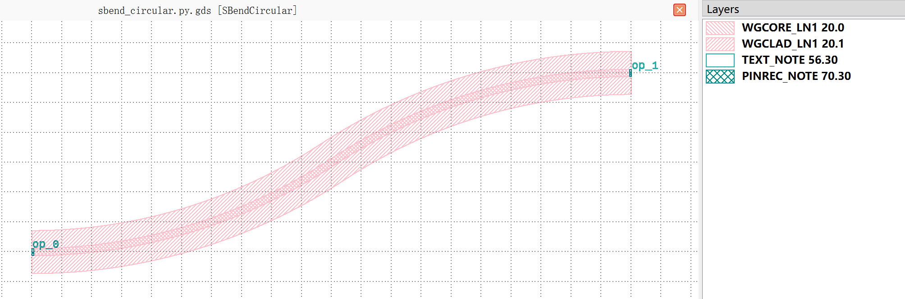

Sbend
#############################################

SBendCircular
******************************************************

+------------------+----------------------+-------------+------------------------------------------------------------------------------------------------------+
| Parameters       |     Range            | Default     | Description                                                                                          |
+==================+======================+=============+======================================================================================================+
|distance          | PositiveFloat value  | 100         | Sbend length.                                                                                        |
+------------------+----------------------+-------------+------------------------------------------------------------------------------------------------------+
|height            | PositiveFloat value  | 30          | Sbend height.                                                                                        |
+------------------+----------------------+-------------+------------------------------------------------------------------------------------------------------+
|min_points        | PositiveInt value    | 200         | Minimum points of sbend.                                                                             |
+------------------+----------------------+-------------+------------------------------------------------------------------------------------------------------+
|min_radius        | PositiveFloat value  | 80          | Minimum radius of sbend.                                                                             |
+------------------+----------------------+-------------+------------------------------------------------------------------------------------------------------+

if all the parameters are set to default values, the device will have 2 ports for waveguide connection. The port and pin information is listed below.  

+----------------------+------------------------+------------------------+-------------+
|      ports           |     waveguide type     | position               |   degrees   |
+======================+========================+========================+=============+
|op_0                  |  TECH.WG.RIB1.C.WIRE   |  (-50.0, -15.0)        |     180     |
+----------------------+------------------------+------------------------+-------------+
|op_1                  |  TECH.WG.RIB1.C.WIRE   |  (50.0, 15.0)          |     0       |
+----------------------+------------------------+------------------------+-------------+

